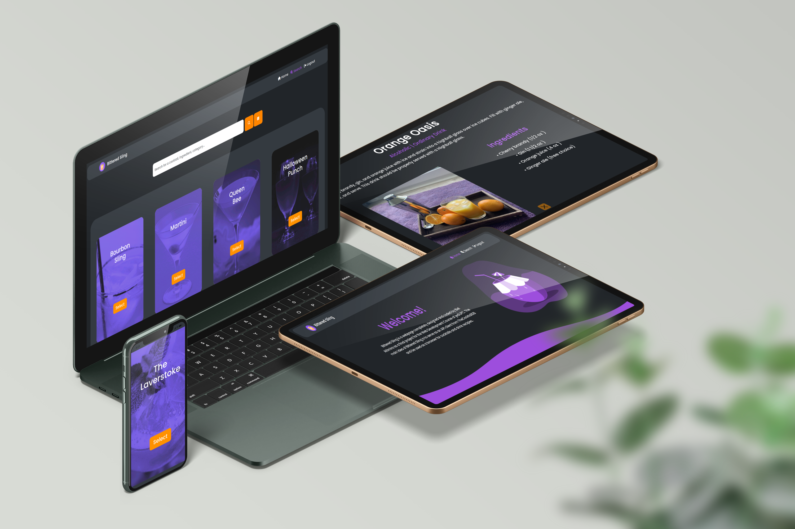
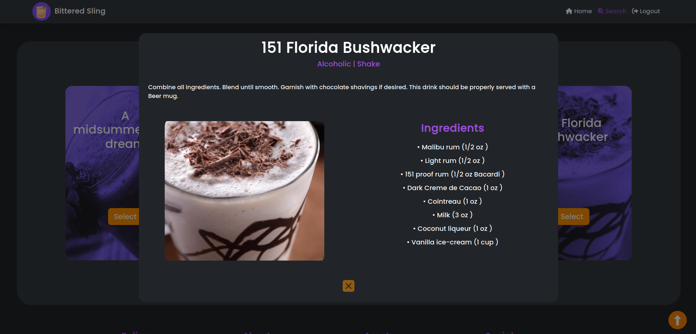

<h1 align="center">
   
  
   
  Bittered Sling
   
</h1>

<h4 align="center"><a href="https://bittered-sling.vercel.app" target="_blank">Web-app</a> that serves as an API client to display cocktail preparation data.</h4>

 

  

## 🔍 About
Bittered Sling is a webpage completely designed and coded by me as the one-week final project for the Web Development Course of jediUPC. The main idea of Bittered Sling is to serve as an API client from TheCocktailDB and be used as a browser for cocktails and drink recipes.

## 🧱 Assets
  * This webpage has been created using base HTML5, CSS3 and JS. 
  * JQuery was also used for the DOM tasks.
  * To fetch the data from the API we were required to use the Axios HTTP client.
  * For the web design, besides some custom CSS, [Font awesome](https://fontawesome.com/) was used for the icons and [Bootstrap](https://getbootstrap.com/) for some utilities.
  
  * For the curved shape dividers, I used [this tool](https://www.shapedivider.app/).

## ⭐ Key Features
Based on the project requirements, the following features can be found while using the web app.

  * User authentication. Without encryption or security mechanisms, it provides a simple user creation and authentication workaround using a `JSON server` hosted on [Railway](https://railway.app/).

  >Login feature not available on the preview version of the website.

  * For session management it uses the browser's `local storage`.

  * It includes error management and provides warnings and notifications for all the session status for a better user experience.

  * `Bootstrap breakpoints` and `media queries` allow the website to be displayed and fully functional on all screen sizes. Despite its `responsiveness`, it's meant to be mainly used on a desktop support.

  * On the `search` tab, the dice feature allows you to be presented with a selection of 4 random drinks.

  * The normal search feature can also be used, and it works following a hierarchy model when creating an entry. You can search following this criteria:
      1. First drink letter
      2. Ingredient
      3. Category
      4. Drink name
      5. Alcohol type
      6. Glass type
   
  The information displayed when selecting a drink is: the preparation steps, ingredients, quantities and tasks and categories.
  

## 🗃️ Credits

This web-app uses the following open source packages:

- [TheCocktailDB](https://www.thecocktaildb.com/)
- [JEDI](https://jediupc.com/)
- [JQuery](https://jquery.com/)
- [Axios](https://axios-http.com/es/docs/intro)
- [Bootstrap](https://getbootstrap.com/)
- [Font Awesome](https://fontawesome.com/)
- [Shape Diriver](https://www.shapedivider.app/)
- [Railway](https://railway.app/)
- [Vercel](https://vercel.com)

## 🚀 About Me
Check out more about my work in my [GitHub profile](https://github.com/BielAltimira/price) or visit my [LinkedIn profile](https://www.linkedin.com/in/biel-altimira-tarter/).

